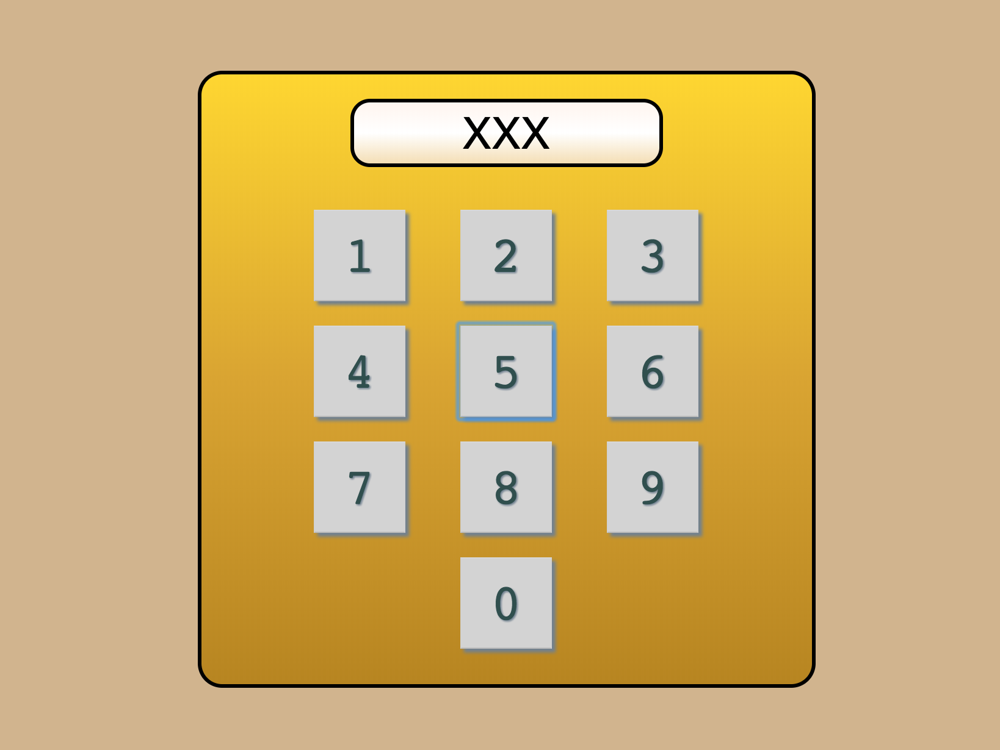
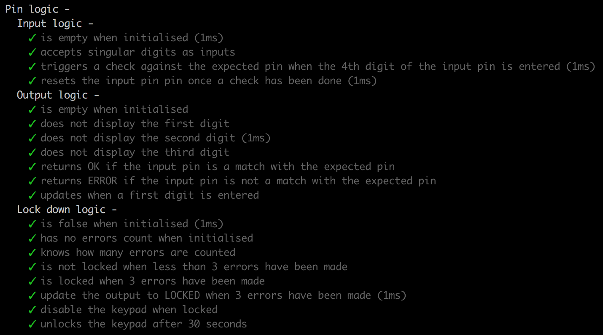

:pager: Simple pin pad :pager:
===
This is Guillaume's Simple pin pad:

Main functionalities:
• Number buttons work with clicks
• The pin is hidden except for the last number
• The exact pin is hardcoded somewhere (and it's my birthday!)
• The pin is 4 digits long
• When 4 digits are entered the pin is checked
• If the inserted PIN is correct the screen displays OK and the pin is reset
• If the inserted PIN is wrong the screen displays ERROR and the pin is reset
• After 3 wrong attempts the pinpad locks for 30 secondss, showing LOCKED on the display

Technologies used:
----
- JavaScript
- ES6 syntax
- create-react-app
- React
- React-Dom
- prop-types
- classname
- HTML Semantic (JSX)
- CSS
- Flexbox
- Jest
- sessionStorage

Desktop preview:
----



Tests preview:
----



How to build it:
----
```
./build.sh
```
PS: the script will ask to chose options regarding running Jest tests; Press a to run all tests, then q to quit the test suite.


Methodology:
----
- I first scaffolded the app through react-create-app.
- I started with unit logic tests and based the game logic on how it is supposed to work.
- I then started with the design.
- I also added snapshots test to make sure that my React components are working in isolation.

What I learnt:
----
- The extra feature was a good reminder of how tricky setTimeOut can become with the use of 'this'.

What to improve:
----
- sass or less compiling instead of css could also be added. styled-components is also a popular option.
- if the project were to grow an application architecture such as Flux or Redux would be a great addition.
- a continuous integration tool can also be used but that also depends on the size of the application.